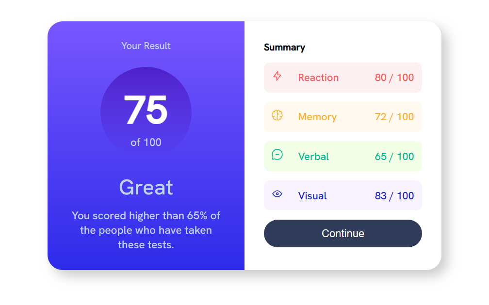
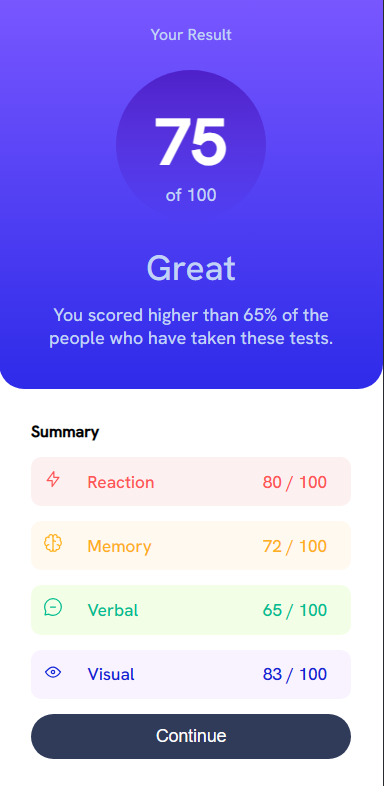

# Frontend Mentor - Results summary component solution

Esta é uma solução para o desafio [Results summary component challenge on Frontend Mentor](https://www.frontendmentor.io/challenges/results-summary-component-CE_K6s0maV). Frontend Mentor desafia você a melhorar suas habilidades de codificação construindo projetos reais. 

## Table of contents

- [Overview](#overview)
  - [O desafio](#o-desafio)
  - [Telas](#telas)
  - [Links](#links)
- [O processo](#o-processo)
  - [Construído com](#construido-com)
  - [O que eu aprendi](#o-que-eu-aprendi)
- [Autor](#autor)

**Note: Delete this note and update the table of contents based on what sections you keep.**

## Overview

Este projeto é o resultado final de um desafio do site FrontEnd Mentor, que disponibiliza designs de páginas a serem criados por seus visitantes utilizando as tecnologias recomendadas. Este projeto foi implementado utilizando os designs sugeridos com as tecnologias HTML5, CSS3 e Javascript.

### O desafio

Os usuários devem ser capazes de::

- Visualizar o layout adequado para o tamanho de tela que estiver utilizando.
- Perceber mudanças a partir de interações com elementos que supostamente devem ser interativos.

### Telas




### Links

- Solution URL: [Add solution URL here](https://your-solution-url.com)
- Live Site URL: [Add live site URL here](https://your-live-site-url.com)

## O processo

### Construido com

- Marcação semnântica no HTML quando aplicável
- propriedades customizadas no CSS
- Flexbox
- CSS Grid
- Mobile-first workflow

### O que eu aprendi

Com este desafio, pude colocar em prática a crição de elementos HTML a partir do Javascript e conhecer os elementos "createTextNode()" e "setProperty()" para criar propriedades em elementos HTML a partir do Javascript.
Também foi possível praticar mais e entender o uso das tecnologias CSS GRID e CSS FLEXBOX.

```js
tdCat = document.createElement('td');
tdCat.setAttribute('class', `${(element.category).toLowerCase()}`);
text = document.createTextNode(element.category);
tdCat.appendChild(text);
tr.appendChild(tdCat);
```

## Autor

- Website - [OrgulhoGeek](https://opiratadigitalwordpress.com)
- Frontend Mentor - [@kadu20es](https://www.frontendmentor.io/profile/kadu20es)
- LinkedIn - [@carloseduval](https://www.linkedin.com/in/carloseduval)
